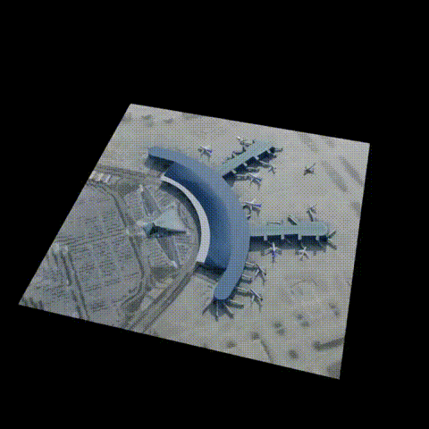
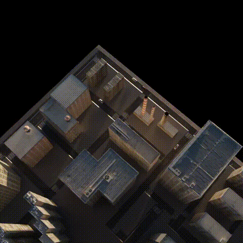
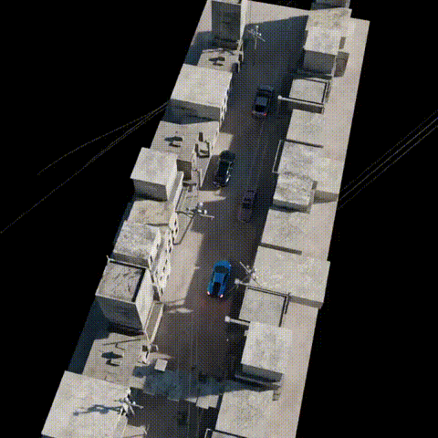
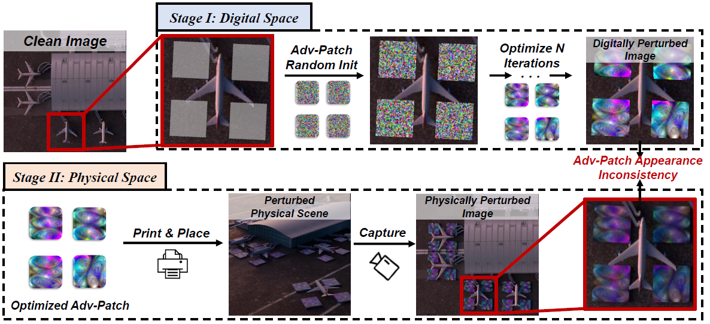

<div align="center">

<h1><a href="https://drive.google.com/file/d/1LPtAQIDBhbNvf_EWOV7SybiG9NYf9T1f/view?usp=drive_link">Digital-to-Physical Visual Consistency Optimization for Adversarial Patch Generation in Remote Sensing Scenes</a></h1>

**[Jianqi Chen](https://windvchen.github.io/), [Yilan Zhang](https://scholar.google.com.hk/citations?user=wZ4M4ecAAAAJ&hl=en&oi=ao), [Chenyang Liu](https://scholar.google.com.hk/citations?user=jBnA45cAAAAJ), [Keyan Chen](https://scholar.google.com.hk/citations?hl=en&user=5RF4ia8AAAAJ), [Zhengxia Zou](https://scholar.google.com.hk/citations?hl=en&user=DzwoyZsAAAAJ), and [Zhenwei Shi](https://scholar.google.com.hk/citations?hl=en&user=kNhFWQIAAAAJ)**


[](#License)
[](https://drive.google.com/file/d/1LPtAQIDBhbNvf_EWOV7SybiG9NYf9T1f/view?usp=drive_link)

</div>

<p align = "center">    



</p>

<p align = "center">    



</p>


### Share us a :star: if this repo does help

This repository is the official implementation of ***VCO-AP***, which tackles with the ***Digital-to-Physical Visual Inconsistency*** problem in current physical adversarial attacks. The PDF version of the paper can be accessed [[here](https://drive.google.com/file/d/1LPtAQIDBhbNvf_EWOV7SybiG9NYf9T1f/view?usp=drive_link)] or [[IEEE](https://ieeexplore.ieee.org/document/10521633)]. ***(Accepted by TGRS 2024)***

If you encounter any question, please feel free to contact us. You can create an issue or just send email to me windvchen@gmail.com. Also welcome for any idea exchange and discussion.

## Updates

[**05/04/2024**] This work is accepted by **TGRS** and the code is now released. 


## Table of Contents

- [Abstract](#Abstract)
- [Requirements](#Requirements)
- [3D Simulated Dataset](#3D-Simulated-Dataset)
- [Self-supervised image harmonization training](#Self-supervised-image-harmonization-training)
- [Craft physical adversarial patch](#Craft-physical-adversarial-patch)
    - [1) Adversarial Patch optimization](#1--Adversarial-Patch-optimization)
    - [2) Apply Adversarial Patch to 3D simulated scenarios](#2--Apply-Adversarial-Patch-to-3D-simulated-scenarios)
- [Evaluate physical attack performance](#Evaluate-physical-attack-performance)
- [Results](#Results)
- [Citation](#Citation)
- [License](#License)


## Abstract



In contrast to digital image adversarial attacks, adversarial patch attacks involve physical operations that project crafted perturbations into real-world scenarios. During the digital-to-physical transition, adversarial patches inevitably undergo information distortion. Existing approaches focus on data augmentation and printer color gamut regularization to improve the generalization of adversarial patches to the physical world. However, these efforts overlook a critical issue within the adversarial patch crafting pipeline—namely, the significant disparity between the appearance of adversarial patches during the digital optimization phase and their manifestation in the physical world. This unexplored concern, termed ***Digital-to-Physical Visual Inconsistency***, introduces inconsistent objectives between the digital and physical realms, potentially skewing optimization directions for adversarial patches. To tackle this challenge, ***we propose a novel harmonization-based adversarial patch attack***. Our approach involves the design of a self-supervised harmonization method, seamlessly integrated into the adversarial patch generation pipeline. This integration aligns the appearance of adversarial patches overlaid on digital images with the imaging environment of the background, ensuring a consistent optimization direction with the primary physical attack goal. We validate our method through extensive testing on the aerial object detection task. To enhance the controllability of environmental factors for method evaluation, ***we construct a dataset of 3D simulated scenarios*** using a graphics rendering engine. Extensive experiments on these scenarios demonstrate the efficacy of our approach.

## Requirements

1. Hardware Requirements
    - GPU: 1x NVIDIA GPU with at least 6GB memory

2. Software Requirements
    - Blender: 3.6 (Need to install the plugin: ***Pro Lighting: Skies***)
    - Python: 3.8
    - CUDA: 11.3
    - cuDNN: 8.4.1

   To install other requirements:

   ```
   pip install -r requirements.txt
   ```

3. Datasets
   - For training the image harmonization network, we leverage the aerial detection dataset - **DOTA (v1.0)**. The training is in a self-supervised way. You can download DOTA from [[here](https://captain-whu.github.io/DOTA/dataset.html)].
   - As for 3D LUTs leveraged to train the image harmonization network, we cannot directly share them here due to the license. However, you can easily find numerous LUTs online, and leverage those for training. Here, we provide our pretrained weight of harmonization network below. 
   - For physical scenarios to evaluate the attack performance, you should download our blend file from [[Baidu Pan](https://pan.baidu.com/s/1suZQxBfyunP_no8uYKmN_g) (code: af8n) | [OneDrive](https://1drv.ms/u/s!AjJZqMEBTzDIjFOznVUw8PVQec9T?e=FY6CAY)]. More details please refer to [3D Simulated Dataset](#3D-Simulated-Dataset) below.

4. Pre-trained Models
   - Our current code involves evaluation on four detectors: **ROITransformer, Rotated RetinaNet, Oriented R-CNN, and Oriented RepPoints**. You can find their configs in the [det_configs](det_configs) folder. For their pretrained weights, please download from [[here](https://github.com/open-mmlab/mmrotate/blob/main/docs/en/model_zoo.md)] and then place them into the directory `pretrained`.
   - We provide **our pretrained harmonization weight** and you can download it from [[Baidu Pan](https://pan.baidu.com/s/17HhY9CWSbzQTPVH_FJk5Jg) (code: btca) | [Google Drive](https://drive.google.com/file/d/1XwPDbYwX85GTxYnOcbju0qBmvcMU8N2R/view?usp=sharing)]. Remember to adaptively change `--save_path_lut` in `main.py`. Also, if you want to train harmonization model yourself, you need to download the encoder weight in advance from [HRNetV2](https://onedrive.live.com/?authkey=%21AMkPimlmClRvmpw&id=F7FD0B7F26543CEB%21112&cid=F7FD0B7F26543CEB&parId=root&parQt=sharedby&parCid=C8304F01C1A85932&o=OneUp) and save the weight in `pretrained` directory.
   
## 3D Simulated Dataset

*For this part, you may need to get familiar with some basic operations of Blender in advance.*

Our constructed 3D simulated scenarios are stored in the file `scenario.blend`. You can easily find our **6 scenes** under the `Scenes` display mode. When turning to `View Layer` display mode, you can find in each scene, there is a folder with word `patch`. By selecting one of the patch and remap its source image path to your adversarial patch's save folder under the `Shader Editor` panel, you then successfully project the adversarial patch into the 3D simulated scenario. Finally, you can render an image of this physically perturbed scene.

We also provide **a useful python code** in the blender file - `data-gen.py`, which involves automatically rendering clean images under different environmental factors, optimizing adversarial patches upon these clean images, projecting adversarial patches to the 3D scenarios, rendering perturbed images, and finally evaluate physical attack performance. You can have a deep look at this code script. (Note that this code need to work collectively with `train.bat` and `evaluate.bat`, and also remember to modify the path in these files adaptively.)

**We also provide detection labels for the 6 scenarios under the current camera position. You can access them in [labels](labels).**

## Self-supervised image harmonization training

To train the image harmonization model, please run:

```bash
python main.py --train --image_root <DOTA image path> --iterations 1000 --lut_path <3D LUTs path> --save_path <save path>
```

- `train`: Whether to train image harmonization, or conduct attack.
- `image_root`: The path where you save the DOTA images.
- `iterations`: The number of training iterations.
- `lut_path`: Where you save the 3D LUTs.
- `save_path`: Where to save the intermediate result during training.

We also provide controls on more settings, you can refer to [main.py](main.py) for more details. After training, you will find the model weight and intermediate visualizations in the folder `<save path>/exp/lut`.

## Craft physical adversarial patch
### 1) Adversarial Patch optimization

Before conducting the optimization, please rearrange your file structure like below: 

(For the optimization based on our 3D scenarios, you should first render *N* images, and then can directly copy the label file, which we provide in [3D Simulated Dataset](#3D-Simulated-Dataset), for the same *N* times.)

```
├── root
    ├── images
        ├── <name_1>.png
    ├── labelTxt
        ├── <name_1>.txt (DOTA-Format)
```

To optimize the adversarial patch, please run:

```bash
python main.py --attack_image_root <DOTA image path> --save_path_lut <harmonization model weight path> --lut_apply --is_eot --det_model_config <detector config> --patch_size <size of adversarial patch> --attack_pos <layout of patch> --attack_epochs 10 --save_path <save path>
```

- `attack_image_root`: The target images' path.
- `save_path_lut`: The checkpoint path of image harmonization model you trained in [Self-supervised image harmonization training](#Self-supervised-image-harmonization-training).
- `lut_apply`: Whether to apply the harmonization network.
- `is_eot`: Whether to incorporate the EOT technology.
- `det_model_config`: The configurations of the target detector.
- `patch_size`: The size of the patch. You can refer to [main.py](main.py) for more information of the settings of this parameter.
- `attack_pos`: The layout of the patches around the target object. Also refer to [main.py](main.py) for more information.
- `attack_epochs`: The number of optimization epochs.
- `save_path`: Where to save the intermediate results during optimization.

We also provide controls on more settings, you can refer to [main.py](main.py) for more details. After optimization, you will find intermediate results in the folder `<save path>/exp/attack`. Within the folder, you will find comprehensive results, including original images, splitting images, perturbed images, detections of perturbed images, detections of merged images, *etc*. We believe these will be very helpful.

### 2) Apply Adversarial Patch to 3D simulated scenarios

You can find more information in [3D Simulated Dataset](#3D-Simulated-Dataset). Simply, you just need to remap the image source path of the adversarial patch in the blender file to your adversarial patches saved within the folder `<save path>/exp/attack`. Then, you can render again, and thus successfully perturb the 3D scenarios.

## Evaluate physical attack performance

After you get the rendered images of the perturbed 3D scenarios, you can replace the previous rendered clean images with these rendered perturbed images, and repeat the processes in [1) Adversarial Patch optimization](#1--Adversarial-Patch-optimization). Then, the previously **"clean" image detection results** now reflect the physical attack performance, since the **"clean"** image is now the perturbed image.

## Results


## Citation & Acknowledgement
If you find this paper useful in your research, please consider citing:
```
@ARTICLE{10521633,
  author={Chen, Jianqi and Zhang, Yilan and Liu, Chenyang and Chen, Keyan and Zou, Zhengxia and Shi, Zhenwei},
  journal={IEEE Transactions on Geoscience and Remote Sensing}, 
  title={Digital-to-Physical Visual Consistency Optimization for Adversarial Patch Generation in Remote Sensing Scenes}, 
  year={2024},
  volume={},
  number={},
  pages={1-1},
  keywords={Physical adversarial attack;adversarial patch;object detection;remote sensing},
  doi={10.1109/TGRS.2024.3397678}}
```
Also thanks for the many great 3D model websites (e.g., Sketchfab and CGTrader). Some of our 3D elements are from them.

## License
This project is licensed under the Apache-2.0 license. See [LICENSE](LICENSE) for details.